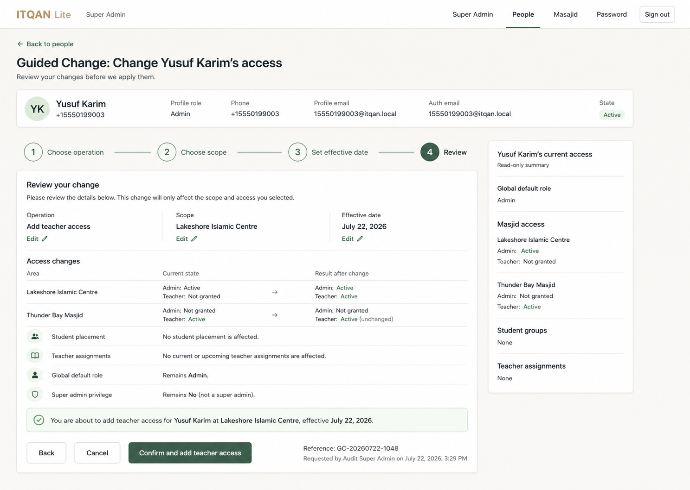
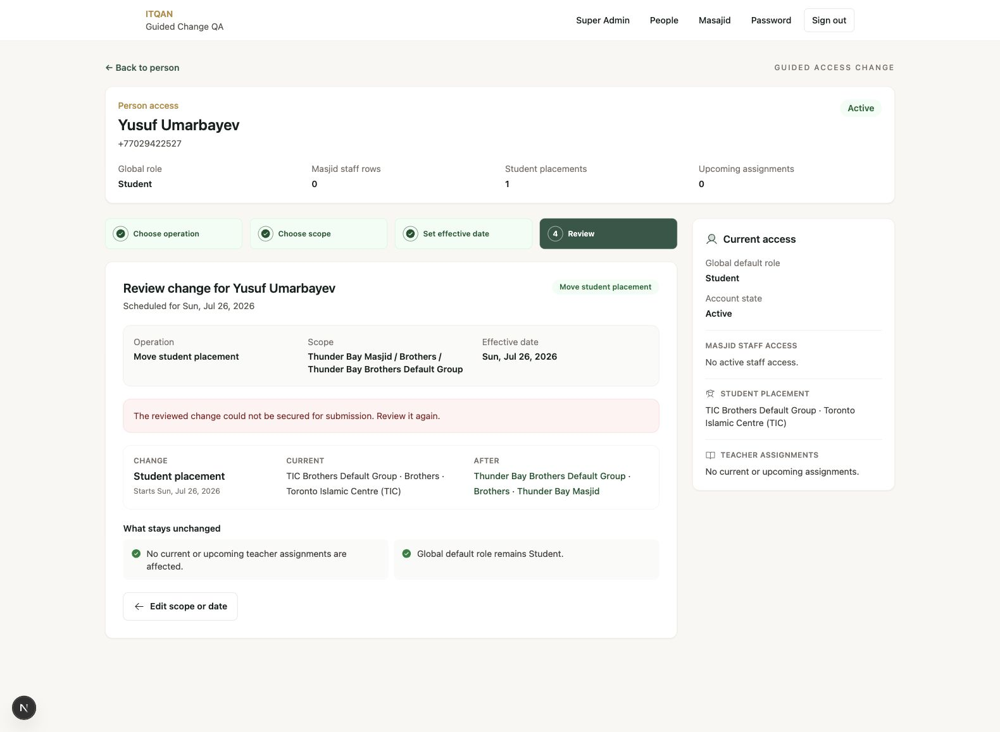

# Super Admin Guided Change — Design QA

## Result

**PASS for the implemented production slice.** The production flow carries the selected Option 3 direction into the existing ITQAN visual system and adapts its operation, scope, before/after rows, unaffected-access statements, confirmations, and submit label from server-calculated state.

The browser walkthrough specifically exercised **Move student placement** for Yusuf Umarbayev from Toronto Islamic Centre to Thunder Bay Masjid. The review correctly showed:

- Operation: Move student placement
- Scope: Thunder Bay Masjid / Brothers / Thunder Bay Brothers Default Group
- Current: TIC Brothers Default Group / Brothers / Toronto Islamic Centre
- After: Thunder Bay Brothers Default Group / Brothers / Thunder Bay Masjid

It did not reuse the prototype's teacher-access or Lakeshore Islamic Centre content.

## Reference and implementation

| Selected direction | Production implementation |
| --- | --- |
|  |  |

Mobile/breakpoint evidence: [production-guided-change-review-mobile.png](./artifacts/design-qa/production-guided-change-review-mobile.png)

## Comparison

| Area | Status | Notes |
| --- | --- | --- |
| Guided four-step structure | Pass | Operation, scope, effective date, and review remain explicit and editable. |
| Current-access context | Pass | A persistent read-only sidebar summarizes global role, state, staff access, student placement, and assignments. |
| Operation-specific review | Pass | Review title, scope, timing, rows, warnings, confirmations, and submit label derive from the selected operation and fresh server state. |
| Before/after comprehension | Pass | Production uses semantic list/definition markup that stacks cleanly below the desktop breakpoint. |
| Safety affordances | Pass | Blockers prevent mutation; typed confirmation and a short-lived server review reference protect ready changes. |
| Responsive behavior | Pass | Verified at a 478px effective viewport with document and body widths equal to the viewport and no overflowing elements. |
| Console health | Pass | No browser console warnings or errors during the walkthrough. |

## Deployment-dependent state

The connected development database does not yet contain `super_admin_guided_change_reviews`, so the live walkthrough correctly displayed a fail-closed message and omitted the confirmation form. This is not a visual implementation defect: applying the included additive migration enables the secured submission state. No remote migration was applied during QA.

## Open design defects

No P0 or P1 visual defects found in the implemented Guided Change slice.
